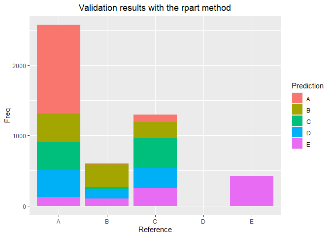
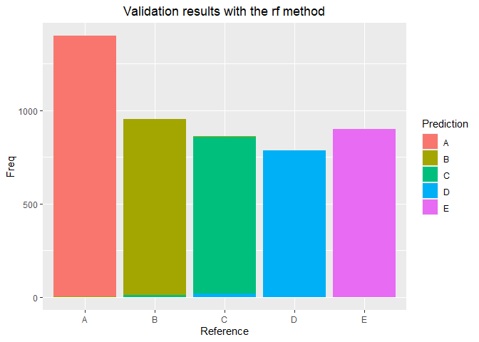

## Executive summary

The purpose of this document is to try and predict the correctness of the execution of barbell lift exercises.  
The initial study is available here:  [Qualitative Activity Recognition of Weight Lifting Exercises](http://groupware.les.inf.puc-rio.br/public/papers/2013.Velloso.QAR-WLE.pdf).  

For this study, we used the same [initial dataset](https://d396qusza40orc.cloudfront.net/predmachlearn/pml-training.csv), but we used our own approach for building a prediction algorithm.  
The R code can be found in the appendix.  
The results run on the test set can be found in the Final Validation section.

## Data preparation 
To perform the analysis, six young health participants were asked to perform one set of 10 repetitions of the Unilateral Dumbbell Biceps Curl in five different fashions: exactly according to the specification (Class A), or with an "error" (Classes B through E). Their physical activity was recorded using different sensors; the results are available in a [dataset](https://d396qusza40orc.cloudfront.net/predmachlearn/pml-training.csv) under Creative Common license (CC BY-SA).  


This dataset consists of 19 622 observations of 160 variables. Unfortunately, many observations are uncomplete - only 406 are actually complete. We also do not need all the variables for the predicitions, so the first step is to clean the dataset.


 
Once cleaned, we are left with 53 variables, which is a lot. A further analysis of correlated variables might determine how many of them are correlated, using a 90% threshold:    


```
## [1] 11
```

We could remove them. However, the methods used to build a prediction model will be partition algorithms; therefore, it does not appear compulsory to reduce the number of variables.  

## Model building
We built 3 different models, trained on a subset of the training set, and validated on a "validation" subset of the training set.  


### 1. Recursive partitioning
The first basic model used is recursive partitioning.  


Time taken to execute this model: 

```
## Time difference of 8.958045 secs
```

Applying this model to our validation set produces the following results:  

```
##  Accuracy 
## 0.4955139
```

<!-- -->

### 2. Bagging
The second model used is bootstrap aggregating. Time taken to execute this model:    

```
## Time difference of 3.872403 mins
```

Applying this model to our validation set produces the following results:  

```
## Accuracy 
## 0.983279
```

<!-- -->

### 3. Random forest
The third model used is a random forest.  


Time taken to execute this model: 

```
## Time difference of 4.177612 mins
```

Applying this model to our validation set produces the following results:  

```
##  Accuracy 
## 0.9926591
```

<!-- -->

### 4. General Boosting model
The fourth model used is gbm.  


Time taken to execute this model: 

```
## Time difference of 3.538151 mins
```

Applying this model to our validation set produces the following results:  

```
##  Accuracy 
## 0.9618679
```

<!-- -->

## Model comparison
On our validation dataset, the four methods perfom as following:

```
##             RPART BAGGING     RF    GBM
## Runtime (s)  8.96  232.20 250.80 212.40
## Accuracy     0.50    0.98   0.99   0.96
```

The basic recursive partitioning method is fast, but has a quite low accuracy. All three other methods have very high accuracy, but long runtimes.  As a compromise, we select the Bagging method to be applied on the test dataset.

## Final validation
Applying the developped Bagging model on a test dataset provides the following results:  


```
##  [1] B A B A A E D B A A B C B A E E A B B B
## Levels: A B C D E
```

## Code


```r
## This chunk allows all the code to be sent to the appendix
knitr::opts_chunk$set( echo = FALSE, warning = FALSE,  message = FALSE,  cache = TRUE )
library(dplyr)          
library(ggplot2)
library(caret)
library(rattle)

set.seed(23)            
 ## downloading and loading the dataset
fileUrl <- "https://d396qusza40orc.cloudfront.net/predmachlearn/pml-training.csv"
if(!file.exists("pml-training.csv")) {
    download.file(fileUrl,"pml-training.csv", mode="wb" )
}
trainset <- read.csv("pml-training.csv")
## cleaning dataset
training <- trainset %>%
  select(roll_belt:classe) %>% ## removing the names of the participants and the time stamps
    select(-c(kurtosis_roll_belt:var_yaw_belt)) %>% ## removing variables which have only 1 value per window
      select(-c(var_accel_arm:var_yaw_arm)) %>%
        select(-c(kurtosis_roll_arm:amplitude_yaw_arm)) %>%
          select(-c(kurtosis_roll_dumbbell:amplitude_yaw_dumbbell)) %>%
            select(-c(var_accel_dumbbell:var_yaw_dumbbell)) %>%
              select(-c(kurtosis_roll_forearm:amplitude_yaw_forearm)) %>% 
                select(-c(var_accel_forearm:var_yaw_forearm))
## checking correlation of left variables
corr <- abs(cor(training[-53]))
(sum(corr >= 0.90)-52)/2
inTrain <- createDataPartition(y=training$classe, p=0.75, list=FALSE)
subtrain <- training[inTrain,]
subvalid <- training[-inTrain,]
start.time1 <- Sys.time()
rpartmod <- train(classe ~., data = subtrain, method = "rpart")
end.time1 <- Sys.time()
time.taken1 <- end.time1 - start.time1
time.taken1
rpartpredict <- predict(rpartmod, newdata=subvalid)
Crpart <- confusionMatrix(subvalid$classe, rpartpredict)
Crpart$overall[1]
grpart <- ggplot(data = data.frame(Crpart$table))
grpart + geom_col(aes(x=Reference, y=Freq, fill=Prediction)) + labs(title = "Validation results with the rpart method") + theme(plot.title = element_text(hjust = 0.5))
start.time2 <- Sys.time()
baggmod <- train(classe ~., data = subtrain, method = "treebag")
end.time2 <- Sys.time()
time.taken2 <- end.time2 - start.time2
time.taken2
baggpredict <- predict(baggmod, newdata=subvalid)
Cbagg <- confusionMatrix(subvalid$classe, baggpredict)
Cbagg$overall[1]
gbagg <- ggplot(data = data.frame(Cbagg$table))
gbagg + geom_col(aes(x=Reference, y=Freq, fill=Prediction)) + labs(title = "Validation results with the bagging method") + theme(plot.title = element_text(hjust = 0.5))
rfControl <- trainControl(method = "cv", number = 3, allowParallel = TRUE, verboseIter=FALSE) ## reducing runtime
start.time3 <- Sys.time()
rfmod <- train(classe ~., data = subtrain, method = "rf", trControl = rfControl)
end.time3 <- Sys.time()
time.taken3 <- end.time3 - start.time3
time.taken3
rfpredict <- predict(rfmod, newdata=subvalid)
Crf <- confusionMatrix(subvalid$classe, rfpredict)
Crf$overall[1]
grf <- ggplot(data = data.frame(Crf$table))
grf + geom_col(aes(x=Reference, y=Freq, fill=Prediction)) + labs(title = "Validation results with the rf method") + theme(plot.title = element_text(hjust = 0.5))
gbmControl <- trainControl(method = "repeatedcv", number = 5, repeats = 1) ## reducing runtime
start.time4 <- Sys.time()
gbmmod <- train(classe ~., data = subtrain, method = "gbm", trControl = gbmControl)
end.time4 <- Sys.time()
time.taken4 <- end.time4 - start.time4
time.taken4
gbmpredict <- predict(gbmmod, newdata=subvalid)
Cgbm <- confusionMatrix(subvalid$classe, gbmpredict)
Cgbm$overall[1]
ggbm <- ggplot(data = data.frame(Cgbm$table))
ggbm + geom_col(aes(x=Reference, y=Freq, fill=Prediction)) + labs(title = "Validation results with the GBM method") + theme(plot.title = element_text(hjust = 0.5))
methods <- c("RPART", "BAGGING", "RF", "GBM")
runtimes <- c(round(time.taken1, 2), round(time.taken2, 2), round(time.taken3, 2), round(time.taken4, 2))
accuracy <- c(round(Crpart$overall[1],2), round(Cbagg$overall[1],2), round(Crf$overall[1],2), round(Cgbm$overall[1],2))
compar <- rbind(runtimes, accuracy)
colnames(compar) <- methods
rownames(compar) <- c("Runtime (s)", "Accuracy")
compar
## downloading and loading the dataset
fileUrl2 <- "https://d396qusza40orc.cloudfront.net/predmachlearn/pml-testing.csv"
if(!file.exists("pml-testing.csv.csv")) {
    download.file(fileUrl2,"pml-testing.csv", mode="wb" )
}
testset <- read.csv("pml-testing.csv")
testpredict <- predict(baggmod, newdata=testset)
testpredict
```
